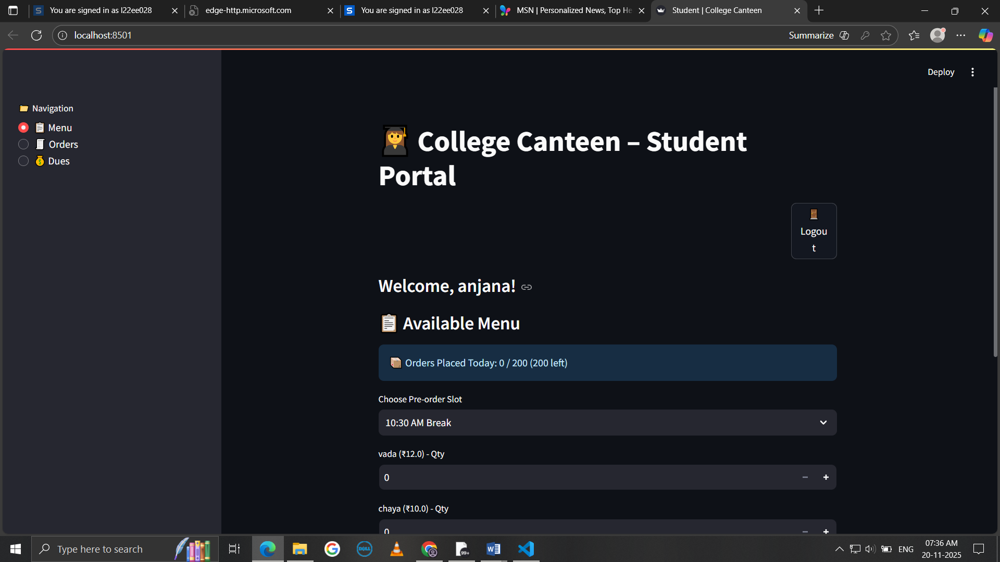
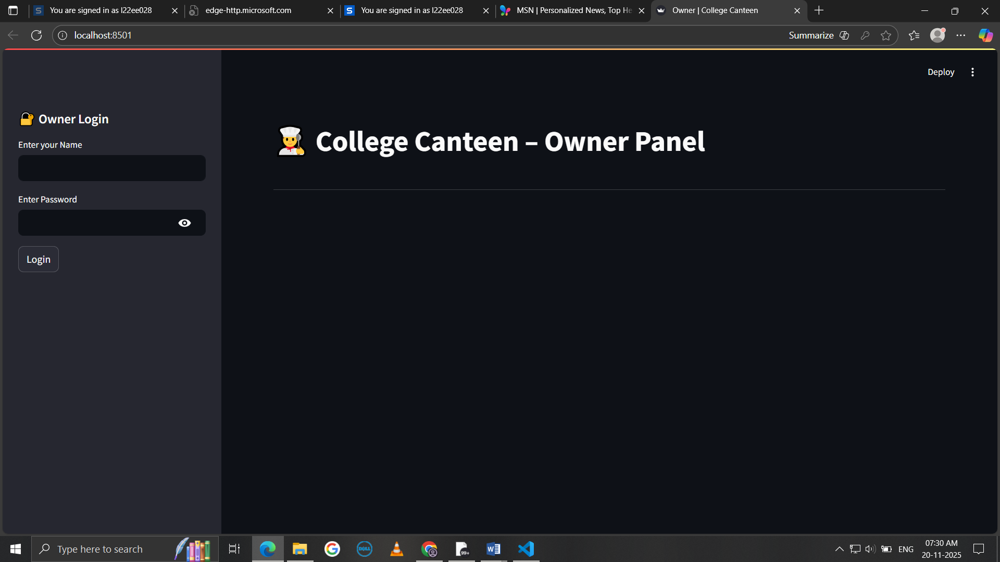
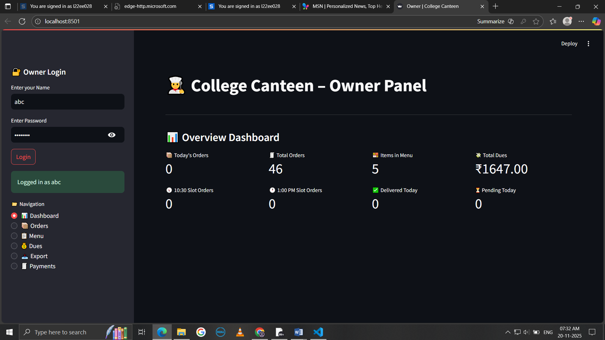
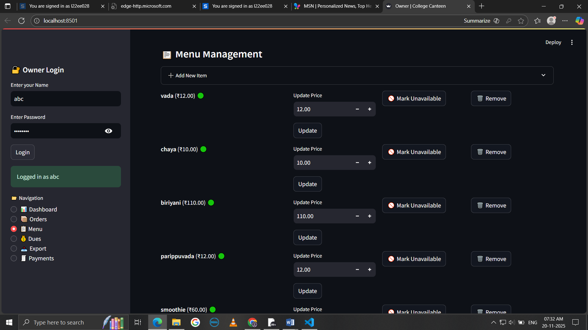
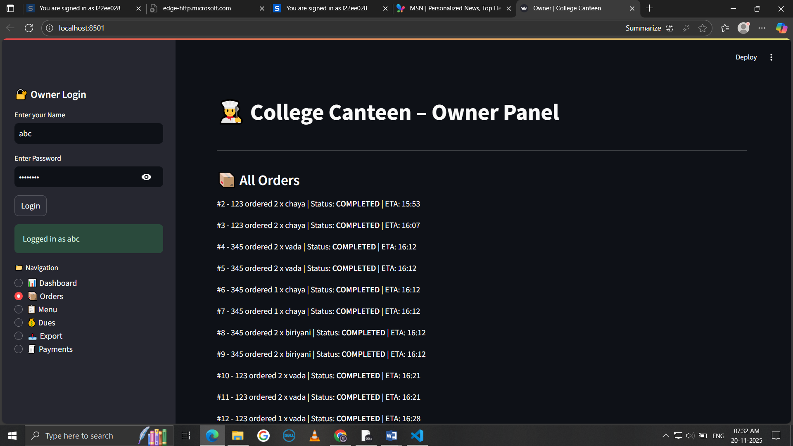
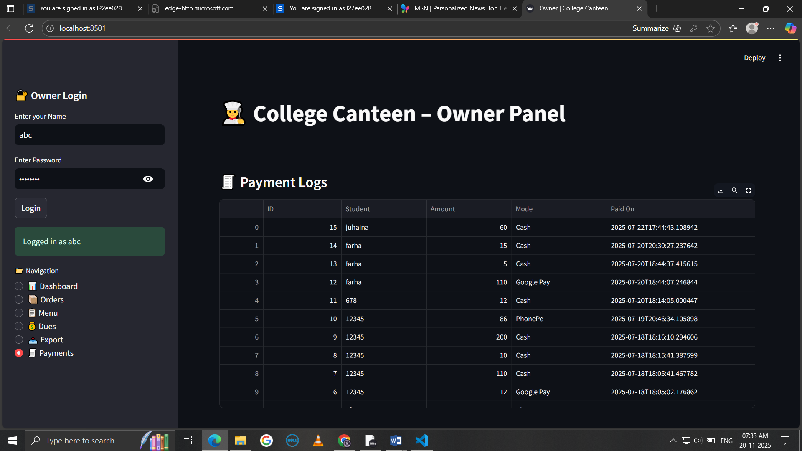

🍽️ College Canteen Management System

A streamlined, user-friendly canteen ordering and management application built using Streamlit + SQLite.
The system allows students to pre-order food, check dues, make payments, and track order status, while owners manage menu items, orders, payments, and daily reports.

---
🎯 Overview
This project aims to remove long queues, reduce food waste, and offer transparency between students and the canteen.

The system includes:
✔ Student portal
✔ Owner/admin dashboard
✔ Time-based ordering restrictions
✔ Dues & payment management
✔ Order tracking
✔ Menu management
✔ Daily summary visualization

---

---
🔧 Features
👨‍🎓 Student Portal
🔐 Secure login & registration (password-protected)
📋 Browse menu & place orders with chosen quantities
⏳ Time-based order restrictions to avoid food wastage:
10:30 AM Break → Order before 9:30 AM
1:00 PM Lunch → Order before 12:00 PM
💳 Pay now or pay later option
💰 View pending dues and clear payments
🧾 Check order history
📦 Track order status (Pending / Completed)
🚪 Logout securely

---

---

👨‍🍳 Owner Dashboard
📊 Overview panel showing:
Total orders
Delivered vs Pending orders
Slot-wise counts (10:30 AM vs 1:00 PM)
🍽️ Manage menu (Add / Update / Remove items)
📦 View all student orders
✔ Mark orders as completed
💳 View payment logs & outstanding dues
📤 Export daily orders to CSV
📈 Daily summary visualization

---
---

🛠 Technologies Used
🐍 Python 3.10+
🎨 Streamlit — front-end UI
🗄️ SQLite — database
📦 Pandas — data export / manipulation
💻 Localhost deployment (optional cloud deploy on Streamlit Cloud / Render)

📂 Project Structure
📦 Canteen_App

'''

│
├── app.py                     # Main Streamlit application
├── database.db                # SQLite database
├── student_functions.py       # Student panel logic
├── owner_functions.py         # Owner dashboard logic
├── utils.py                   # Helpers for UI, validation, etc.
├── images/                    # Screenshots for README
│   ├── student_ui.png
│   ├── owner_dashboard.png
│   └── order_summary.png
├── requirements.txt           # Dependencies
└── README.md                  # Documentation

'''

📸 Student Output Screenshots

🖼️ Student Dashboard

  

🖼️ Ordering

  

🧾 Order Summary / History

  

💳 Pending Dues & Payments

  

🍽️  Menu

  

🖼️ Slot Choosing

  

🖼️ Payment

  

📸 Owner Output Screenshots
📊 Owner Login

  

📊 Owner Dashboard Overview

  

🍽️ Menu Management

  

🍽️ order history

  

📈 Daily Summary

  

📊 Payment Log

  

🚀 How to Run Locally
1️⃣ Clone the Repository
git clone https://github.com/Anjana71/Canteen_App.git
cd Canteen_App

2️⃣ Install dependencies
pip install -r requirements.txt

3️⃣ Run the App
streamlit run app.py

🔮 Future Enhancements

📱 Student Mobile App (Flutter / React Native)

🔔 Real-time order notifications

🎫 QR-code based pickup system

🚀 Cloud deployment

💳 UPI / Wallet integration

🧮 Analytics dashboard for long-term food planning

❤️ Acknowledgements

Streamlit

SQLite

Pandas

Matplotlib / Seaborn
